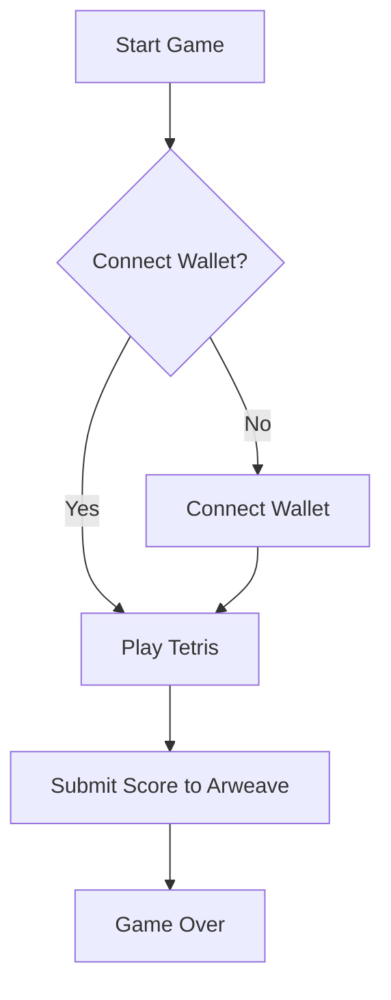

```markdown
# 🎨 Anon Xardacity: A Node.js Tetris Game on Arweave 🚀

```ascii
                                  _.--""--._
                                .'          `.
                               /   O      O   \
                              |    \  ^^  /    |
                              \     `----'     /
                               `. _______ .'
                                  //_____\\
                                 (( ____ ))
                                  `-----'
                                  Tetris AO
```

> Play Tetris on the Arweave blockchain!  A stunning, visually engaging game built with Next.js, React, and Arweave integration.


## 🌟 Feature Highlights ✨

*   **Arweave Integration:**  Gameplay data is stored securely and permanently on the Arweave blockchain. 💫
*   **Responsive Design:**  Enjoy seamless gameplay on desktops and mobile devices. 📱
*   **Classic Tetris Gameplay:**  Experience the familiar and addictive Tetris mechanics. 🎮
*   **Wallet Connection:** Connect your Arweave wallet to track your high scores on the blockchain. 🔑
*   **Persistent High Scores:** Your scores are permanently recorded on Arweave, ensuring they're never lost. 🏆
*   **Smooth Animations:**  Enjoy fluid animations built using GSAP for a premium gaming experience. ⚡


---

## 🛠️ Tech Stack 📦

| Technology       | Badge                                                                     |
|-----------------|--------------------------------------------------------------------------|
| Node.js          |  |
| Next.js          |   |
| React            |      |
| Tailwind CSS     |  |
| Arweave          |  |
| GSAP             |  |


---

## 🚀 Quick Start ⚡

1.  **Clone the repository:**
    ```bash
    git clone https://github.com/nikhilsinghrathore1/anon-xardacity.git
    ```
2.  **Install dependencies:**
    ```bash
    cd anon-xardacity
    npm install
    ```
3.  **Run the development server:**
    ```bash
    npm run dev
    ```

---

## 📖 Detailed Usage 📚

This section provides detailed usage instructions and code examples.

### Connecting Your Wallet

> Connecting your Arweave wallet allows you to save your high scores permanently on the blockchain.


```javascript
// ... (import statements) ...

async function connectWallet() {
    // Your wallet connection logic here...
}

// ... rest of the code ...
```

### Game Mechanics

The game follows standard Tetris rules.  Use the arrow keys to control the falling pieces.


---

## 🏗️ Project Structure 📁

```
anon-xardacity/
├── app/
│   ├── game/
│   │   └── page.jsx  // Tetris game logic
│   └── page.jsx     // Landing page
├── public/
│   └── ...          // Static assets
├── package.json
└── ...
```

---

## 🎯 API Documentation 📊

| Method  | Endpoint         | Description                                      | Parameters           | Response             |
|---------|-------------------|--------------------------------------------------|-----------------------|-----------------------|
| `POST`  | `/api/score`     | Submits a new high score to Arweave.             | `{ score: number }` | `{ transactionId: string }` |


```javascript
// Example API call (using fetch)
fetch('/api/score', {
  method: 'POST',
  headers: {
    'Content-Type': 'application/json'
  },
  body: JSON.stringify({ score: 1000 })
})
.then(response => response.json())
.then(data => console.log(data));
```


---

## 🔧 Configuration Options ⚙️

| Option        | Type    | Default | Description                                         |
|----------------|---------|---------|-----------------------------------------------------|
| `BOARD_WIDTH` | `number` | `10`    | Width of the game board.                            |
| `BOARD_HEIGHT`| `number` | `20`    | Height of the game board.                           |


---

## 📸 Screenshots/Demo 🖼️


---

## 🤝 Contributing Guidelines 🌟

1.  Fork the repository.
2.  Create a new branch.
3.  Make your changes.
4.  Test your changes thoroughly.
5.  Create a pull request.


---

## 📜 License & Acknowledgments 🙏

This project is licensed under the [MIT License](./LICENSE).  Thanks to [Arweave](https://www.arweave.org/) for providing the underlying technology.


---

## 👥 Contributors 🧑‍💻

*   [Nikhil Singh Rathore](https://github.com/nikhilsinghrathore1)  (Maintainer)


---

## 📞 Support & Contact ✉️

[](https://twitter.com/nikhilsinghrathore1)




```markdown
<details><summary>FAQ</summary>
<p><strong>Q: What is Arweave?</strong></p>
<p>A: Arweave is a decentralized storage network that ensures your game data is stored permanently and securely.</p>
<p><strong>Q: How do I submit my score?</strong></p>
<p>A: Your score is automatically submitted to Arweave upon game completion.</p>
</details>
```

```markdown
## Roadmap 🎯

- [ ] Implement multiplayer functionality.
- [ ] Add more game modes.
- [ ] Improve UI/UX.
- [x] Initial release.
```
```
